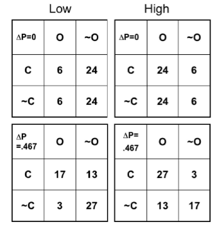
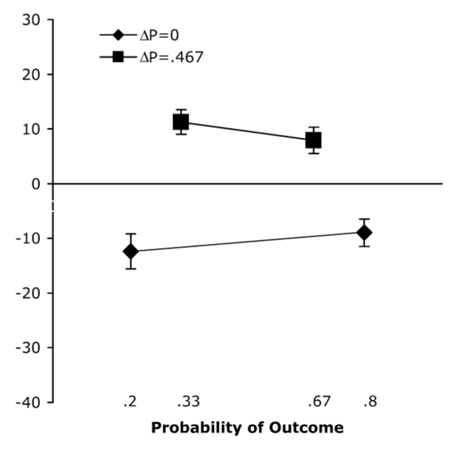

```{r setup, include = FALSE}
library("papaja")
```

```{r analysis-preferences}
# Seed for random number generation
set.seed(42)
knitr::opts_chunk$set(cache.extra = knitr::rand_seed)
```

# Introduction

Imagine driving down a highway at a speed of sixty miles per hour. Suddenly, you hear on the radio that a car accident has occurred on the same highway that you are driving on. Given your previous experience with driving on this highway, you anticipate a longer commute time. Why did you predict a longer commute? How was this anticipation formed? Is the anticipation accurate or biased? These types of questions are asked by researchers when studying contingency learning and judgments, which include the cognitive processes enabling people to become sensitive to  whether particular stimulus predict particular outcomes. The purpose of studying human contingency judgments is to gain a better understanding of the way that people learn about the causal relationships between events [@beckersEditorialHumanContingency2007].

There are many different theories of how people become sensitive to contingency information. The purpose of this thesis was to propose a new memory-based explanation using  a computational model based on MINERVA 2, which is a simulation model of episodic memory [@hintzmanMINERVASimulationModel1984,@hintzmanSchemaAbstractionMultipletrace1986,@hintzmanJudgmentsFrequencyRecognition1988]. Before explaining the model, I will first review the current literature on human contingency judgments. The review will describe tasks and phenomena in the domain, discuss current theories of contingency learning and explain how they differ from my proposal. Finally, I will describe and explain MINERVA 2 before applying the model to simulate results from @crumpContingencyJudgementsFly2007.

## The contingency judgment literature: tasks and phenomena

### What is a contingency?

Contingency is formally defined as a statistical relationship between two dichotomous, binary variables. In this thesis, I will refer to two kinds of events cues and outcomes, both of which can occur or not occur. For example, the notice of an accident on the highway could be a cue; and, observing a slow-down in traffic following the cue could be an outcome.  The contingency between a cue and outcome is established over a history of event pairings. There are four possible cue-outcome pairings that can be presented with varying frequencies to manipulate the cue-outcome relationship; and, these are shown in Table 1. 

(ref:contingencytable) A 2x2 contingency table for a single cue and outcome.

```{r contingencytable, fig.cap="A 2x2 contingency table for a single cue and outcome. The letters A, B, C, and D represent the frequency of occurrence of each event pair."}
library(tibble)
contingency_table <- tribble(
  ~"", ~Outcome, ~"No Outcome",
  "Cue", "A", "B", 
  "No Cue","C","D",
)

library(papaja)
papaja::apa_table(contingency_table, caption= "(ref:contingencytable)")
```

Table 1 displays a 2x2 contingency table representing the four different cue-outcome pairings. The letters represent the frequency of each event pair. First, a cue is presented and an outcome occurs (A). Second, a cue is presented and an outcome does not occur (B). Third, a cue is not presented and an outcome occurs (C). Fourth, a cue is not presented and an outcome does not occur (D). Conventionally, the contingency between the cue-outcome pairs over all events is defined by the $\triangle$P rule (see Allan, 1980). The formula to compute $\triangle$P is:

$\Delta P = \frac{A}{A+B} - \frac{C}{C+D}$

In other words, $\Delta P$ is a difference between two conditional probabilities:

$\Delta P = P(Cue|Outcome) - P(Cue|No Outcome)$

$\triangle$P can range from 1 to -1, and behaves similarly to a correlation coefficient. When $\triangle$P is 1, the presence of a cue perfectly predicts the occurrence of an outcome; and, the absence of the cue perfectly predicts the absence of the outcome. When $\triangle$P is -1, the presence of a cue predicts the absence of an outcome, and the absence of cue predicts the presence of the outcome. When $\triangle$P approaches 0, the presence or absence of the cue does not predict the presence or absence of the outcome.

To return to the highway traffic example, a person may anticipate that traffic will slow down after hearing about an accident because they may be sensitive to a positive contingency relationship between accident events and the consequences for traffic flow. In a laboratory scenario, it is possible to measure peoples' abilities to judge contingencies between events using a variety of contingency judgment tasks discussed next.

### Assessing contingency judgment ability

The discrete-trial procedure is a common method used to measure contingency judgment ability. @allanHumanContingencyJudgments1993 describes several studies that use the discrete-trial procedure. For example, on each trial, @allanJudgmentContingencyNature1980 presented subjects with an empty lake scene in which they could respond by either moving or not moving a joystick. After performing this action, the scene would either change to a picture of the lake with the Loch Ness Monster in it, or it would remain the same. Allan also describes a study by @shanksForwardBackwardBlocking1985, in which participants were shown a tank moving across the screen and passing a gun sight. Participants chose either to fire or not fire at the tank, and then observed whether or not the tank was destroyed. In general, in these tasks, people are presented with pairs (ABCD frequency information) of cue-outcome events over a series of trials, and then asked to make judgments of contingency between the cue and the outcome at the end of the series of trials. For example, in the Loch Ness monster example, after viewing a series of events, participants could be asked to rate the contingency between their response and the appearance of the Loch Ness Monster.

This thesis provides a memory-based explanation for contingency judgment phenomena from @crumpContingencyJudgementsFly2007, who used the streamed trials procedure. The streamed-trials procedure is essentially a faster version of the discrete-trials procedure. For example,  in the streamed-trials procedure, cues and outcomes for each event are presented for 100 ms intervals, separated by another short intertrial interval of 100ms intervals. That study used abstract cues and outcomes. For example, cues were displayed as a blue square that appeared or or did not appear, and outcomes were displayed as a red circle that appeared or did not appear. A streamed-trial consisted of 60 events presented to participant, followed by a question to rate the contingency between the cue and outcome. A benefit of the streamed-trials procedure was that individual participants could be presented with many streamed trials over the course of an experiment. As a result, it was possible to conduct within-subject repeated measures designs, and measure how a single subject's ratings changed across different levels of $\Delta P$ programmed into each streamed trial.Although there are many contingency judgment tasks to choose from, the modelling efforts in this thesis were focused on the design and results from @crumpContingencyJudgementsFly2007. The important aspect was not the streamed trial nature of that design. Instead, the design conveniently demonstrated two important contingency judgment that are found across tasks. Thus, the major aim of the modelling effort was to determine if the model could successfully explain hallmark findings in the literature.

### Classical contingency judgment phenomena

The modelling effort focused on explaining two major phenomena defined as the contingency effect, and the outcome density effect. Both are explained in turn.The contingency effect is the basic finding that humans are capable of making contingency judgments that appear to track $\Delta P$. For example, when the programmed $\Delta P$ value in a series of cue-outcome events is positive, participants judgements of contingency tend to be positive, and when the $\Delta P$ value in a series of cue-outcome events is negative, participants judgements of contingency tend to be negative. In other words, participants judgments of contingency tends to vary as a function of the actual $\Delta P$ between the events they are judging.  

The outcome density effect is an example of a bias in contingency judgment. A bias occurs when people make contingency judgments that are different from the actual $\Delta P$ value between the events. The outcome density effect is the finding that ratings of contingency are also biased by the overall proportion of outcomes, which can be statistically independent from $\Delta P$. Specifically, participants rate cues as more predictive of outcomes that are more frequent than less frequent. In summary, this thesis identified the contingency effect and outcome density bias as a useful starting point to test a new memory model of contingency judgments. Before elaborating on the new model, I now review a few of the existing theories.

## Theoretical process accounts of Contingency judgments

What psychological mechanisms are involved in making contingency judgments? Several theories can be used to explain the way in which contingency judgments work. Next, I review rule-based, associative, and signal detection accounts of contingency judgments before describing the memory-based approach taken in this thesis.

### Rule-based accounts

Rule-based theories explain contingency judgments in terms of the application of formulas, much like the way a statistician would compute contingency values. [@allanHumanContingencyJudgments1993]. For example, Allan discusses the $\triangle$P rule, which is defined as the difference between two independent conditional probabilities. It is possible that  people act like "calculators", and use the $\triangle$P formula  when making contingency judgments. A relatively recent development in ordering packages from Amazon is a real-world example we can use to illustrate this idea. The company now posts a photo online of the package on the doorstep to show that  an order was delivered; however, this is not always the case. Four possible cue-outcome events can occur. First, an order is delivered (cue) and a picture (outcome) is posted (A). Second, an order is delivered and a picture is not posted. Third, an order is not delivered and a picture is posted. Fourth, an order is not delivered and a picture is not posted. Anyone familiar with Amazon delivery could be asked to rate the contingency between package delivery and photo evidence of the delivery. . According to rule-based theory,  a person could do this by explicitly using the $\triangle$P formula. 

Explicit rule-based contingency judgments would involve a set of additional processes. First, a person would need to estimate or obtain the frequencies of each of the A, B, C, and D cue-outcome events. These frequencies could be estimated in some unknown fashion through some memory process, or a person could potentially review the history of Amazon orders to obtain accurate frequencies. Then, to make the contingency judgment, they would need to understand that the $\triangle$P formula is an appropriate measure of contingency judgment, and they would need to enter the frequency values into the formula, calculate the $\triangle$P value, and report the value as their contingency judgment. 

Although it is clear that people may have the ability to use algebra and apply mathematical rules to transform frequency information into a contingency judgment, it is much less clear that people use this approach in everyday life. For example, people seem able to sense contingency information on an intuitive level without explicitly applying rules. And, if people were using the $\triangle$P rule alone, then it is unclear why biases in contingency judgment would appear such as the outcome density effect.

### Associative accounts

Associative theory explains that contingency judgments depend on associative knowledge formed automatically through classical conditioning processes. According to this line of reasoning, contingency knowledge, like associative bonds, is learned through the repeated presentation of stimuli. And, people rely upon their existing associative knowledge when making judgments. In other words, a contingency judgment should roughly reflect a read-out of the strength of association between a cue and outcome. One implication of the associative view, is that phenomena that influence how people learn associations should also influence contingency judgments.

Consider the Rescorla-Wagner model of learning [@rescorlaTheoryPavlovianConditioning1972]explains that when a CS is frequently paired with a US and is consistent in eliciting a CR, the CS has acquired associative strength. Under these circumstances, participants will easily come to associate the CS with the US, and respond accordingly. This aspect of the model can account both for the standard contingency effect and the outcome density effect in human contingency judgments. For example, frequent exposure to cue-outcome events (CS-US events) will increase the associative bond between the cue and outcome and support increasingly more positive contingency judgments. 

Additionally, the Rescorla-Wagner model suggests that the amount of learning diminishes as a conditioned stimulus becomes more familiar. model explains that Furthermore, Rescorla and Wagner state, "changes in the strength of a stimulus depend upon the total associative strength of the compound in which that stimulus appears". Rescorla and Wagner support their assertion that all stimuli present when the US occurs are important to consider, by demonstrating that their model can explain the blocking effect [@kaminPredictabilitySurpriseAttention1969], which occurs when a new association is unable to be properly formed due to a previous association with the US.  Similarly, blocking phenomena have been demonstrated in human contingency judgment tasks [@shanksForwardBackwardBlocking1985], which further supports the notion that associative processes may be involved in human contingency judgment.

### Signal-detection accounts

Signal detection theory [@greenSignalDetectionTheory1966] is a measurement framework that can  separate one's ability to differentiate between actual information (sensitivity) and biases that can emerge during a judgment task.For example, contingency judgments are formed based on one's ability to report on their internal sensitivity to contingency information[@allanPsychophysicsContingencyAssessment2008,@siegelApplyingSignalDetection2009]. The signal detection approach does not specify how people become sensitive to contingency information, and it is compatible with other models like the associative account which could explain sensitivity in terms of association bond formation. Several factors may influence one's judgment. A minimum amount of change is necessary for one to be able to notice whether something is different from what they have previously experienced.  There is also a minimum amount of stimulation required in order for someone to be aware that something is happening. If a significant amount of time is elapsed between two events, one may be less likely to predict that one event caused another. For example, if you eat spoiled food but do not get sick until three weeks later, you may be less likely to predict that the food caused the illness than if you had become sick immediately after consumption.Further, noise interference also plays a role. This can be anything that distracts a participant while they are trying to focus on the contingency task, such as thoughts, sounds, or other objects in sight. These factors can influence, positively or negatively, one's memory of the contingency task. A major contribution of the signal detection approach is to determine whether contingency judgment phenomena potentially reflect changes in sensitivity or bias. For example, @allanPsychophysicsContingencyAssessment2008 demonstrated the outcome density effect reflects a bias in reporting the strength of contingency rather than a more fundamental change to the process responsible for acquiring associative knowledge.

### Memory accounts

Although memory for previous experience is clearly relevant to the task of making judgments about contingency between cues and outcomes that appeared over time, the role of memory processes in contingency judgments has not been broadly discussed [but see, @arkesMemoryRetrievalContingency1985] or formalized. This thesis examines whether a computational model of human memory, MINERVA II, could provide a useful memory-based explanation of contingency judgment phenomena.

MINERVA II is a multiple-trace theory of memory. It is assumes that individual experiences are encoded as traces into memory. Furthermore, it assumes that repeated exposure to the same information creates multiple copies rather than strengthening the same memory. A major assumption is that representations of an individual experience are roughly wholistic, that is they include the collection of details present in the experience within the representation for that trace. In other words, a single trace potentially contains all of the contextual information embedded within a specific experience. MINERVA II can behave similarly to an associative account, however it does not directly learn or form associative bonds between cues and outcomes. Instead, the whole history of cue-outcome pairings is stored within separate traces in memory. Minerva II also assumes that retrieval operates in a cue and similarity driven fashion. A cue or pattern in the environment is compared to traces in memory and activates similar memory traces in parallel, which are then used at retrieval. 

In principle, MINVERA II should be able to perform a contingency judgment task. For example, it would be possible to provide the memory with examples of cue-outcome events just as participants are in the discrete trials procedure. Then, the memory could be probed with a cue pattern or the absence of a cue pattern. In both cases, similar to the process of cued-recall, the memory would retrieve different amounts of contextual information that were paired with the cue within the memory traces. In other words, MINERVA II should retrieve expectations for the outcome given a cue. The question I set out to answer in this thesis was whether the MINERVA II process would also produce contingency effects and the outcome density bias in the same way that people do. Before moving on to the simulations, I describe MINERVA II in more detail.


## MINERVA II

MINERVA II is a computational instance theory of human memory [@hintzmanMINERVASimulationModel1984; @hintzmanJudgmentsFrequencyRecognition1988; @hintzmanSchemaAbstractionMultipletrace1986]. It is conceptually similar to other global-similarity models of memory [@murdockTODAM2ModelStorage1993; @eichCompositeHolographicAssociative1982]. MINERVA II and related models have been applied to explain many kinds of cognitive phenomena and processes such as recognition memory [@arndtTrueFalseRecognition1998], probability judgment and decision-making [@doughertyMINERVADMMemoryProcesses1999], artificial grammar learning [@jamiesonApplyingExemplarModel2009], serial reaction time task performance [@jamiesonApplyingExemplarModel2009a], associative learning phenomena [@jamiesonInstanceTheoryAssociative2012], and computational accounts of semantic knowledge [@jamiesonInstanceTheorySemantic2018].

In MINERVA 2, memory is a matrix $M$. Each row represents a memory trace, and the columns represent features of the trace.

How does encoding work? Individual events are represented as feature vectors $E$, and new events are stored to the next row in the memory matrix $M$. Individual features are stored with probability $L$, representing quality of encoding. For example, in the present simulations I used a feature vector with 30 elements. The first 10 elements coded the presence or absence of the cue. When the cue was present, the elements were set to 1. When the cue was absent, the elements were set to 0. The 11th to 20th elements coded the outcome, again setting the elements to 1 or 0 depending on whether the outcome was present or absent. The elements 21 to 30 coded the background context, and were set to 1 for all traces.

How does retrieval work? A probe (feature vector for a current event in the environment) is submitted to memory, and causes traces to activate in proportion to their similarity to the probe. Similarity between each trace and the probe is computed with a cosine:

$S_i = cos(\theta) = \frac{A \dot B}{||A|| ||B||}$

$S_i = \frac{\sum_{i=1}^n A_iB_i}{\sqrt{\sum_{i=1}^n A_i^2}\sqrt{\sum_{i=1}^n B_i^2}}$

Where A is a probe and B is a memory trace in $M$.

Activation is a function of similarity raised to a power of three, and it is possible to further raise the exponent The exponent, sometimes also called resonance, acts like a tuning parameter causing only the most similar traces to be viable for retrieval as resonance is increased.

$A_i = S_i^3$

Each trace is then weighted by its activation (cubed similarity) to the probe, and summed to produce an echo.

$C_j = \sum_{i=1}^m A_i \times M_{ij}$

How is a contingency judgment computed? We take the raw values in the outcome portion of the echo as measures of expectation for the outcome given the cue. More specifically, we ask the model to derive a contingency judgment in two steps. In the first step, the model is probed with a cue-present feature vector that contains no outcome. This probe will tend to be more similar to traces that contain a cue-present feature, causing those traces to be more highly represented in the retrieved echo. To the extent that those traces include pairings with the outcome, the outcome features will also be present in the echo. To measure the extent to which the cue retrieves an expectation for the outcome, we simply recorded the raw value in the echo from the first element of the outcome field (the 11th unit). In the second step, we probe the memory with a cue-absent feature vector and record the expectation for the outcome. These two values are similar to the conditional probability of receiving an outcome given a cue, and receiving an outcome given no cue. The model-based contingency judgment was thus taken as a difference between the expectations.

# Simulation 1

Our experiment is based on a research study performed by @crumpContingencyJudgementsFly2007. While this study involved presenting humans with a contingency task, our computer model attempts to replicate the findings of this study, and expand upon it. The @crumpContingencyJudgementsFly2007 study tested for the contingency effect as well as the outcome density effect by manipulating the number of cues and outcomes presented in each condition. Specifically, they used a 2x2 design manipulating both contingency and outcome density. The contingency manipulation involved streamed-trials that include zero contingency or a medium positive contingency. The outcome density manipulation involved streamed-trials that included a low or high proportion of outcomes. These levels were crossed to produce the four conditions shown in Figure 1. 

```{r, fig.cap = "Original 2x2 contingencies tables reprinted from Crump, Hanah, Allan, \\& Hord, (2007). The top two matrices outline the frequency of the four cue-outcome pairings in a (left) low outcome density noncontingent stream, $\\triangle$P = 0, P(O) = .2, and a (right) high outcome density noncontingent stream, $\\triangle$P = 0, P(O) = .8. The bottom two matrices define a (left) low outcome density contingent stream, $\\triangle$P = .467, P(O) = .33, and (right) high outcome density contingent stream,  $\\triangle$P = .467, P(O) = .67.", out.width="3in", fig.align = "center"}


```

After viewing a streamed-trial participants were asked at random to complete a contingency rating judgments or a frequency estimate judgments. The contingency rating judgments were collected using a sliding scale, where participants could choose between -100 and +100. In order to take in frequency estimate judgments, participants were presented with four images, each representing one of the four cue-outcome events. One field was left empty, in which participants were told to write in an estimate of the frequency of occurrence for each circumstance.

```{r, fig.cap = "Original results reprinted from Crump, Hanah, Allan, \\& Hord, (2007).", out.width = "3in", fig.align="center"}

knitr::include_graphics("imgs/crump_results.png")
```

The original results from @crumpContingencyJudgementsFly2007 are shown in Figure 2. The figure shows that, for non-contingent conditions ($\triangle$P=0, diamond shape), contingency ratings were lower for both low and high outcome density conditions. Participants' contingency ratings were highest overall during contingent conditions ($\triangle$P=.467, diamond shape). This trend indicates that the $\triangle$P effect is present. However, regardless of stream condition, contingency ratings were always higher when outcome density was larger. This shows that the outcome density effect is present.

The purpose of simulation 1 was to deliver the same set of conditions as in @crumpContingencyJudgementsFly2007 to MINERVA II, and then determine whether the model makes similar patterns of contingency judgments. In particular, we were interested in whether the model would show both the standard contingency effect as well as the outcome density effect.


## Methods

We used RStudio to create a model of memory. Our model was presented with two types of streams, non-contingent and contingent. Non-contingent refers to trials where $\triangle$P is 0. This means there is no relationship between the cues and outcomes shown, regardless of outcome density. Cues do not predict outcomes, and outcomes do not predict cues. Contingent refers to trials where $\triangle$P is .467, where the presence of a cue does foreshadow the presence of an outcome. Each type of stream contained two conditions, low outcome density and high outcome density. Low outcome density refers to a trial in which fewer outcomes were presented than cues. Four types of trials were presented to the model. The model was presented with either, a cue and an outcome, a cue and no outcome, no cue and an outcome, or no cue and no outcome. After being shown these combinations many times, our model was asked to predict whether an outcome would occur given that cues were presented first with no outcomes.

As mentioned earlier, MINERVA II is a multiple trace model, and so it assumes that each experience leaves an individual memory trace. With repeated exposure to the same information, it creates multiple copies rather than strengthening the same memory. MINERVA II is mostly focused on long-term memory, however, there is assumed to be a temporary buffer (short-term memory) that relay information to long-term memory. The model was programmed in R and the code is presented in Appendix 1.

The original experiment performed by @crumpContingencyJudgementsFly2007 involved a blue square being presented as the cue and a red circle being presented as the outcome. Our model presents cues and outcomes to the model as sets of 0s and 1s. 0 being not present, 1 being present. If a cue was presented first (1), it may have either been followed by an outcome (1), or no outcome (0). If no cue was presented first (0), it was either followed by no outcome, or an outcome. In theory, the more cues and outcomes presented, the more accurate the model will be at predicting the presence or absence of each.


```{r, error=FALSE, message=FALSE, warning=FALSE}
knitr::write_bib(c("base", "knitr",
            "rmarkdown",
            "ggplot2",
            "papaja",
            "lsa"), file = "R_pkgs.bib")

```

I used the following open-source software for the model code, analyses, and to create this thesis as a reproducible report, `r cite_r("R_pkgs.bib")`.

```{r, echo=FALSE}
### Model code for simulation 1

## create contingency task trials

create_trials <- function(A, B, C, D, vector_length, shuffle=FALSE){

  event_frequencies <- rep(c(1,2,3,4), times = c(A,B,C,D))

  event_pairs <- matrix(c(rep(c(1,1,1), each = vector_length),
                          rep(c(1,0,1), each = vector_length),
                          rep(c(0,1,1), each = vector_length),
                          rep(c(0,0,1), each = vector_length)),
                      ncol= vector_length*3,
                      byrow=TRUE)

  event_matrix <- event_pairs[event_frequencies,]

  if(shuffle==FALSE) {return(event_matrix)
    }else{
    return(event_matrix[sample(1:length(event_frequencies)),])
    }

}

## Run the model function

run_model <- function(trials,probe){
  memory <- trials

#probe memory with cue only

  similarities <- c()
  for(i in 1:dim(memory)[1]){
    similarities[i] <- lsa::cosine(probe,memory[i,])
  }
  similarities[is.nan(similarities)]<-0

  # generate echo
  weighted_memory <- memory*(similarities^3)
  echo <- colSums(weighted_memory)

  return(echo)
}

### DEFINE conditions

conditions <- list(list(outcome_density = .2,
                        delta_p = 0,
                        frequencies = c(6,24,6,24)),
                   list(outcome_density = .8,
                        delta_p = 0,
                        frequencies = c(24,6,24,6)),
                   list(outcome_density = .33,
                        delta_p = .467,
                        frequencies = c(17,13,3,27)),
                   list(outcome_density = .67,
                        delta_p = .467,
                        frequencies = c(27,3,13,17))
                   )

model_data<-data.frame() #initialize data frame

## Run the model across conditions

for(i in 1:4){
  trials <- create_trials(A=conditions[[i]]$frequencies[1],
                          B=conditions[[i]]$frequencies[2],
                          C=conditions[[i]]$frequencies[3],
                          D=conditions[[i]]$frequencies[4],
                          vector_length = 10,
                          shuffle=TRUE)
  model_output <- run_model(trials=trials,probe = rep(c(1,0,1),each=10))
  sim_data <- data.frame(outcome_density = conditions[[i]]$outcome_density,
                         delta_p = conditions[[i]]$delta_p,
                         expectation = model_output[11])
  model_data <- rbind(model_data,sim_data)
}

# print table
#knitr::kable(model_data)
```

## Results

```{r, fig.cap = "Mean Contingency Ratings Based on Outcome Density.", fig.width=5, fig.height = 3, fig.align='center'}
# plot
library(ggplot2)

model_data$delta_p <- as.factor(model_data$delta_p)

ggplot(model_data,aes(x=outcome_density,
                      y=expectation,
                      group=delta_p,
                      color=delta_p,
                      shape=delta_p))+
  geom_line()+
  geom_point()+
  xlab("Probability of Outcome")+
  ylab("Outcome Activation  \n Strength in Echo")+
  coord_cartesian(xlim=c(0,1), ylim= c(0,20))+
  scale_color_discrete(name = expression(Delta~P))+
  scale_shape_discrete(name = expression(Delta~P))+
  theme_classic(base_size=12)

```

Did our MINERVA model produce a similar $\triangle$P effect and outcome density effect to those found in the @crumpContingencyJudgementsFly2007 study? The results of the model simulations are shown in Figure 3. For both contingent ($\triangle$P=.467) and non-contingent ($\triangle$P=0) streams of data, contingency ratings (Outcome Activation Strength in Echo) were lower when less outcomes were presented (low outcome density, lower Probability of Outcome). Just like the human participants in the original study, our computer model also had higher contingency ratings when more outcomes were presented than cues (high outcome density, greater Probability of Outcome). In contingent conditions, contingency ratings were much higher overall than in non-contingent conditions. Overall, the  results paralleled those of the original study, providing some initial support for a memory-based view of contingency judgment.

# Simulation 2

I noted briefly earlier that @crumpContingencyJudgementsFly2007 manipulated the judgment that participants gave following each trial. Specifically, participants either received a contingency rating task, or a frequency estimation task. For the frequency judgment task, participants were asked to estimate the frequency of each of the four cue-outcome event pairs that were presented in the trial. With this measure, it was possible to derive a contingency value from the frequency estimates. The results from the frequency judgments in the original study are presented in figure 4. 

```{r, fig.cap = "Mean transformed $\\triangle$P scores derived from participants frequency estimates (with standard error) as a function of $\\triangle$P (0 vs. .467) and outcome density. Reprinted from Crump et al. (2007)", out.width="3in", fig.align = "center"}


```


The interesting finding was that the outcome density bias was no longer present for contingency ratings derived from frequency estimates. The purpose of Simulation 2 was to determine whether MINERVA II would show a similar pattern if it was asked to make frequency judgments. Notably, MINERVA II was developed originally in part to explain frequency judgments [@hintzmanJudgmentsFrequencyRecognition1988], so it can naturally be applied to frequency judgments in the contingency judgment task.

## Methods

Simulation 2 was nearly identical to Simulation 1 with the following exceptions. After each streamed trial, the model was probed with one of the four cue-outcome event pairs, and following @hintzmanJudgmentsFrequencyRecognition1988, the sum of the similarity weighted activations was recorded as the model response. The four responses were then entered directly into the $\Delta P$ formula to compute a frequency derived contingency value. Additionally, the model was evaluated for different levels of resonance, which is the exponent used to raise the similarities. The simulation code is reported in Appendix 2.

## Results

```{r}
## Simulation 2

run_model_activations <- function(trials,probe,resonance){
  memory <- trials

#probe memory with cue only

  similarities <- c()
  for(i in 1:dim(memory)[1]){
    similarities[i] <- lsa::cosine(probe,memory[i,])
  }
  similarities[is.nan(similarities)] <- 0

  # get activations
  activations <- sum(similarities^resonance)

  return(activations)
}

# frequency judgment simulation
freq_model_data <- data.frame() #initialize data frame

## Run the model across conditions

for(tau in c(1,3,9,15,21,27)){
  for(i in 1:4){
    trials <- create_trials(A=conditions[[i]]$frequencies[1],
                            B=conditions[[i]]$frequencies[2],
                            C=conditions[[i]]$frequencies[3],
                            D=conditions[[i]]$frequencies[4],
                            vector_length = 10,
                            shuffle=TRUE)
    
    freq_A <- run_model_activations(trials=trials,probe = rep(c(1,1,1),each=10),resonance = tau)
    freq_B <- run_model_activations(trials=trials,probe = rep(c(1,0,1),each=10),resonance = tau)
    freq_C <- run_model_activations(trials=trials,probe = rep(c(0,1,1),each=10),resonance = tau)
    freq_D <- run_model_activations(trials=trials,probe = rep(c(0,0,1),each=10),resonance = tau)
    
    sim_data <- data.frame(outcome_density = conditions[[i]]$outcome_density,
                           delta_p = conditions[[i]]$delta_p,
                           expectation = (freq_A/(freq_A+freq_B)) - (freq_C/(freq_C+freq_D)),
                           resonance = tau)
    
    freq_model_data <- rbind(freq_model_data,sim_data)
  }
}


```

Did our second simulation produce similar results to that of @crumpContingencyJudgementsFly2007? The results of Simulation 2 are reported in figure 5. The figure shows the model evaluated using six different levels of resonance. As the resonance level increased (generalization decreased, exponent value increased), the model became more precise at making estimates of frequency judgements. In other words, when the exponent value was low, the model was being asked to remember more generally. Under these circumstances (most often when resonance was 1), the model over-generalized, neglecting to discriminate between positive contingencies and zero contingencies. Activation intensity was similar regardless of which cue was used as a probe. The model gave similar frequency estimates for all cue-outcome situations. This resulted in estimated delta P values of 0.

<!-- 
Let's split the results section into three main points


1. The model's ability to discriminate between positive and zero increases as resonance increases...explain why discrimination failed when resonance was low? 

- when resonance is low (e.g.,  1), the model over-generalizes. Specifically, regardless of the cue used to probe memory, the activation intensity for any cue is similar. 
-the result is that the model gives similar frequency estimates for all ABCD cells, which produces estimated delta p values of 0.

-->

<!--
2. We successfully modeled the lack of an outcome density effect. 

-->

As it became greater, the model was being asked to remember more specific instances. The outcome paralleled that of the original study, with the model not being biased by outcome density. As expected, this contrasts the results of Simulation 1. For noncontingent streams ($\triangle$P=0), frequency estimates (Simulated $\triangle$P) tended to be closer to 0, and largely did not differ as a function of Probability of Outcome or in conditions with greater resonance.  For contingent streams ($\triangle$P=.467), frequency estimates tended to be close to .467 in conditions where resonance was greater than 3. They also largely did not vary with regard to Probability of Outcome. This again brings up the possibility that the type of judgement requested may be the cause of bias. Notably, however, in conditions where resonance was low, there is an inversion of the outcome density effect for frequency estimates close to zero. Instead of estimating an effect when more outcomes were present, the model estimates a greater simulated delta P value when less outcomes were present. This contrasting the outcome density effect found in humans during the Crump et al. (2007) study.

<!--
3. yes, we eliminated the outcome density effect, but it appears there is a small reversal. For example, when resonance is 3, 9, 15, estimated delta p appears slightly smaller as outcome density increases. 
-->

```{r, fig.cap = "Mean model contingency ratings derived from model estimates of frequency judgments.", fig.width=7, fig.height = 3, fig.align='center'}
# plot
library(latex2exp)
freq_model_data$delta_p <- as.factor(freq_model_data$delta_p)

ggplot(freq_model_data,aes(x=outcome_density,
                      y=expectation,
                      group=delta_p,
                      color=delta_p,
                      shape=delta_p))+
  geom_line()+
  geom_point()+
  xlab("Probability of Outcome")+
  ylab(TeX(r'(Simulated $\Delta$P)'))+
  coord_cartesian(xlim=c(0,1))+
  scale_color_discrete(name = expression(Delta~P))+
  scale_shape_discrete(name = expression(Delta~P))+
  theme_classic(base_size=12)+
  facet_wrap(~resonance)

```

# General Discussion

The purpose of this experiment was to create a simulated version of the study performed by @crumpContingencyJudgementsFly2007. In general, our model was able to replicate several attributes of the in-person study, such as the $\triangle$P conditions and the outcome densities associated with them. This suggests that contingency judgments can be explained in terms of memory processes.

## Limitations

Our model contains several key differences when compared with the original study done by @crumpContingencyJudgementsFly2007. One major difference between our model and the in-person study is that our simulation did not produce any negative ratings. Specifically, the outcome density effect was not present. Several factors may explain this result, such as the fact that no human participants were included in our study. In the low outcome density condition ($\triangle$P=0) of the original study, human beings gave negative ratings. This was likely due to the outcome density effect. This phenomenon was not present in our simulation data. Another factor that may explain this result is the possibility that we overlooked particular variables when creating our model. It could be the case that we neglected to implement code for some aspect of attention or memory.

In order to create a simulated version of memory, our model makes several assumptions. For instance, our model assumes that each memory has its own trace (multiple-trace theory). In order to operationalize cue and outcome events, we use binary values to represent the presence or absence of an occurrence. To operationalize similarity between events, we use the cosine function. We also use resonance to operationalize a way to amplify the relative differences in our data. 


<!-- 
Consider adding some discussion about the psychological representation of similarity

Some points to consider:

- we are making assumptions in the model about similarity relations between memory traces
-  We defined the representations for cues and outcomes in a simple fashion, using binary values to signify presence or absence. These assumptions impact the similarities between events. We are also assuming the cosine function to operationalize similarity. 

- with resonance we are assuming that there is a process that can bring out relative differences between similarities.

Some questions to consider:

How does our feature representation scheme influence similarity between traces and probes, and overall model behavior?

What kinds of representational schemes are theoretically sensible? How should we code for the presence or absence of features in a feature vector?

-->

By studying contingency judgments, we can gain a better understanding of factors that influence learning, memory, and eventually decision making. Our results indicate that there is a relationship between the number of times an outcome is shown, and one's prediction of whether or not an outcome will occur based on a cue. This general principle may have real-world implications, such as in regard to interpreting data. One may falsely attribute one variable to causing another based on often experiencing both variables together. This relates to the statistical principle "correlation does not imply causation". 

## Future Research

In order to create a model that produces results that are more accurate to the original study, we could create a negative contingency condition. This condition would set P equal to -.467, meaning that the presence of a cue would predict the absence of an outcome. This has the potential to make the model more likely to give negative ratings of contingency.


\newpage

# References

```{=tex}
\begingroup
\setlength{\parindent}{-0.5in}
\setlength{\leftskip}{0.5in}
```
::: {#refs custom-style="Bibliography"}
:::

\endgroup

```{r, eval=FALSE}
papaja::render_appendix('appendix-1.Rmd')
```


```{r echo = FALSE, results = 'asis', cache = FALSE}
papaja::render_appendix('appendix-1.Rmd')
```


```{r echo = FALSE, results = 'asis', cache = FALSE}
papaja::render_appendix('appendix-1.Rmd')
```


```{r echo = FALSE, results = 'asis', cache = FALSE}
papaja::render_appendix('appendix-1.Rmd')
```


```{r echo = FALSE, results = 'asis', cache = FALSE}
papaja::render_appendix('appendix-1.Rmd')
```


```{r echo = FALSE, results = 'asis', cache = FALSE}
papaja::render_appendix('appendix-1.Rmd')
```


```{r echo = FALSE, results = 'asis', cache = FALSE}
papaja::render_appendix('appendix-1.Rmd')
```


```{r echo = FALSE, results = 'asis', cache = FALSE}
papaja::render_appendix('appendix-1.Rmd')
```

